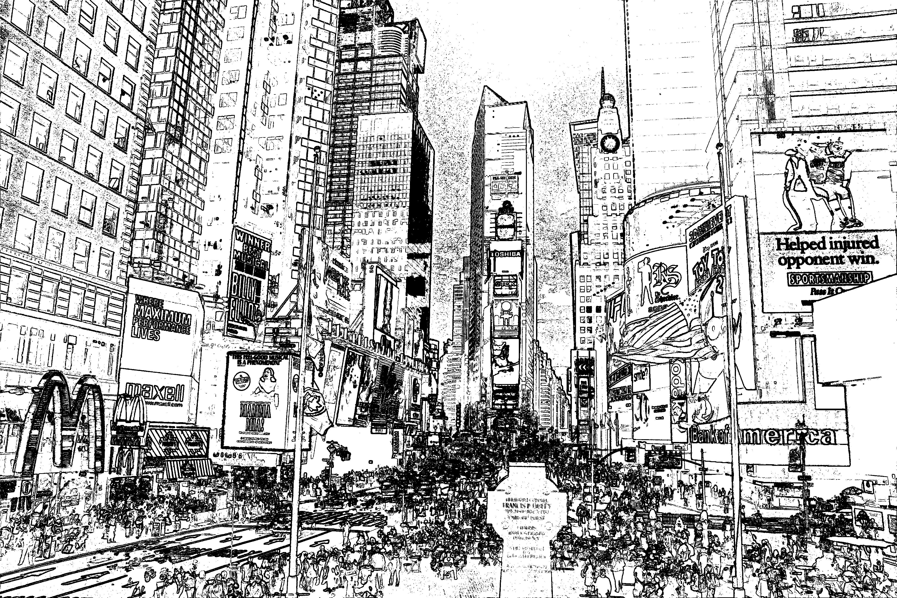
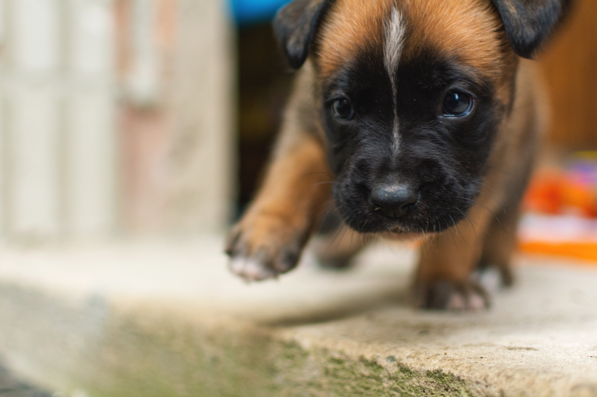
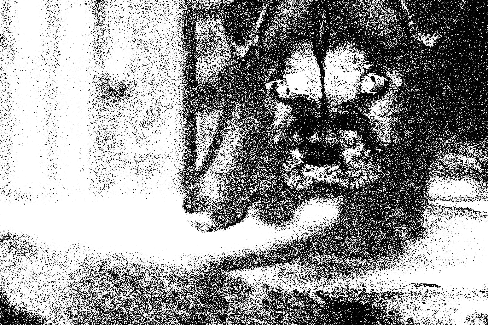
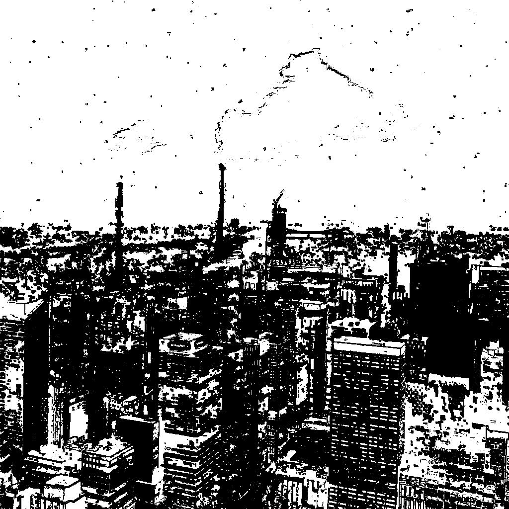
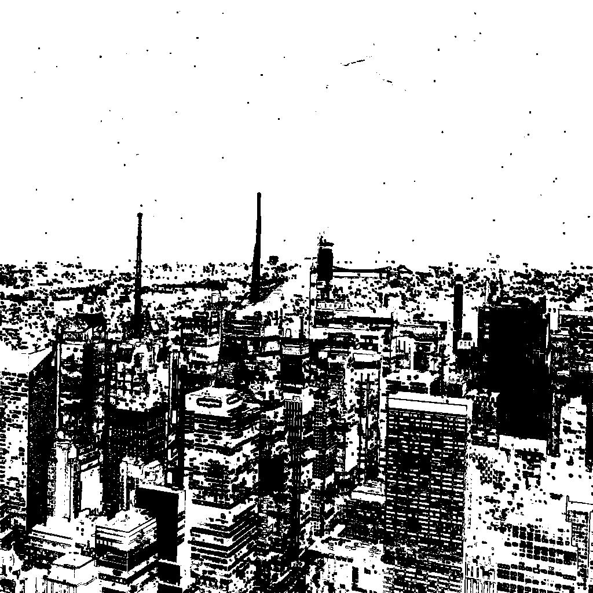
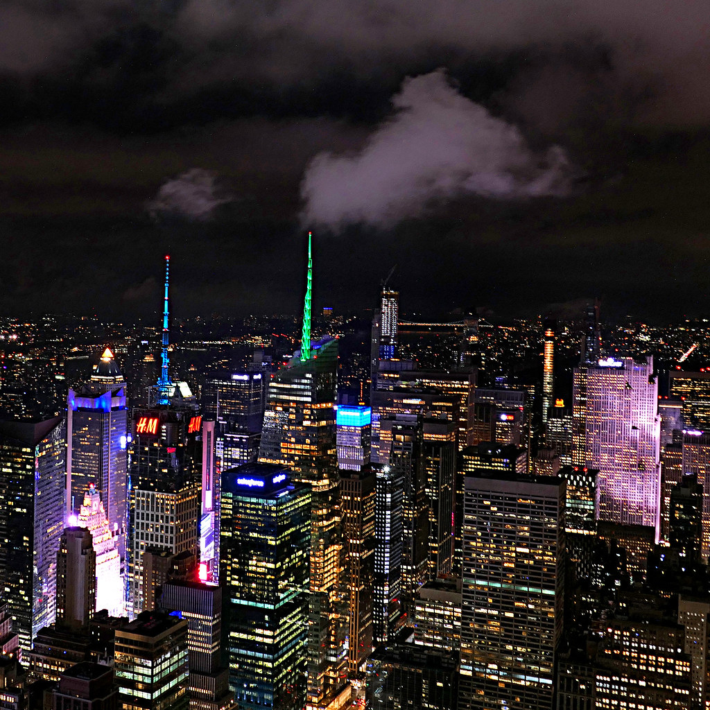

### ImageToLines

This is a program that converts your image to a series of lines (and sometimes dots).

The way that this works is quite simple. 
The program just takes the image and loops over each pixel, for which it samples all 9 surrounding pixels (including the pixel it's iterating over), and it calculates the average difference/contrast, for which it then places a pixel if there's enough contrast, and doesn't place a pixel if there isn't enough.

To start you want to compile the program using cargo build. 
Then you want to create the files img_name.txt, pixel_drawing_settings.txt. 
You can then plop in your image. 
Write the filepath to your image in img_name.txt. 
Then write the contrast setting (what minimum contrast is required to draw a pixel) in pixel_drawing_settings.txt (there are currently no other settings that can be modified in pixel_drawing_settings.txt, but modifying the executable is easy enough). 
After that you can run the program and you should have your image in output.jpeg! 

Btw, this uses the CPU rather than the GPU. The speed is still good enough for quick and easy use, where even a high quality images don't take that long to generate.

Here are some examples of the program in action (the sources for these images are in ./image-examples/ImageLinks.txt, and should be under the Creatives Commons Licenses, if they aren't or there are any other issues, please post an issue so that I can fix it):

And here below are 2 examples of how the minimum contrast to draw a pixel setting affects the image (this can be from 0-255): 

This is the difference at 5:

This is the difference at 10:

